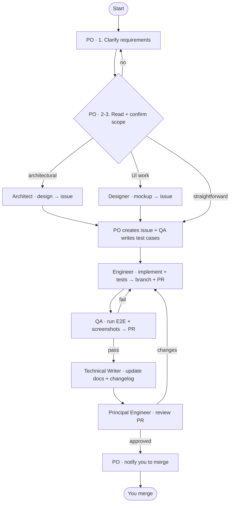

# projects — a Product-Owner-led team workflow for Claude Code

> A Claude Code plugin that turns a single agent into a coordinated software team. One **Product Owner** talks to you; six specialist subagents do the work and collaborate through **GitHub issues and pull requests**.

<p align="left">
  
  
  
  
</p>

---

## Why

Most agent workflows blur every role into one context: the same agent clarifies the requirement, designs it, writes it, tests it, and reviews its own code. Quality suffers and there's no paper trail.

**`projects` separates the roles.** You speak only to a **Product Owner**, who clarifies scope and then *delegates* each piece of work to the right specialist. Each specialist loads its own focused skill, does one job well, and publishes its output to GitHub — so the work is traceable, reviewable, and the team stays in sync the way a real engineering team does.

It is **project-agnostic**: stack, repo, and commands are resolved from the codebase at runtime, so the same plugin works across every project.

---

## The team

| Skill | Role | Talks to you? | Responsibility |
|-------|------|:---:|----------------|
| **`projects:product-owner`** | Product Owner *(entry point)* | ✅ | Clarify intent, confirm scope, create & orchestrate the issue, dispatch specialists, report back |
| `projects:architect` | Software Architect | ❌ | Agree the technical approach for non-trivial work; post a design doc to the issue |
| `projects:designer` | UX/UI Designer | ❌ | Produce UI mockups + maintain the design system |
| `projects:engineer` | Software Engineer | ❌ | Implement the change with unit tests; open a branch and a PR |
| `projects:qa` | Software QA Engineer | ❌ | Design test cases on the issue; run E2E + post results/screenshots |
| `projects:reviewer` | Principal Software Engineer | ❌ | Authoritative code review (Google Eng Practices); final sign-off |
| `projects:docs` | Technical Writer | ❌ | Keep the documentation set current; mandatory changelog every change |

> You invoke **`projects:product-owner`**. It dispatches the rest — each specialist invokes its own skill first.

---

## Workflow



Every deliverable lives on the **issue** or **PR** — never only in chat. The Product Owner orchestrates by reading GitHub state.

---

## Install

This repo is both a **plugin** (`projects/`) and a **marketplace** (`.claude-plugin/marketplace.json`).

### From GitHub

```bash
claude plugin marketplace add nattaponra/skills
claude plugin install projects@0xlabs-skills
```

### From a local clone

```bash
git clone https://github.com/nattaponra/skills.git
claude plugin marketplace add ./skills
claude plugin install projects@0xlabs-skills
```

Restart your Claude Code session — the skills load at startup and become invocable as `projects:product-owner`, `projects:architect`, etc.

> Cost: ~360 tokens always-on (just the descriptions). Specialist bodies load only when invoked.

---

## Usage

Start any change by invoking the Product Owner:

```
/projects:product-owner
```

…or just describe the work ("fix the upload bug", "add CSV export") in a session where the plugin is installed — the Product Owner's trigger covers fixing bugs, adding features, and refactoring.

From there the Product Owner drives the full cycle: clarify → confirm → (design / mockup) → issue → implement → E2E → docs → review → notify you to merge. **It never merges for you** — you stay in control of `main`.

---

## What makes it more than a checklist

- **GitHub is the source of truth.** Architect designs, QA test cases, E2E results, and reviews are posted to the issue/PR — not relayed through chat.
- **Written team feedback loop.** Any agent can give feedback to a teammate via a `FEEDBACK.md` log. Each agent reads feedback addressed to it before working and applies it.
- **Durable self-improvement.** When feedback recurs, the agent promotes it into its own skill's *Lessons learned* section, so it gets better across sessions — not just within a task.
- **Docs never drift.** The Technical Writer keeps the doc set current and adds a `CHANGELOG.md` entry on **every** change; the Principal Engineer blocks the PR if it's missing.
- **One authoritative review.** A Principal Engineer gives the final technical sign-off following Google Engineering Practices.

---

## Repository structure

```
.
├── .claude-plugin/
│   └── marketplace.json        # marketplace "0xlabs-skills" → lists the plugin
└── projects/                   # the plugin
    ├── .claude-plugin/
    │   └── plugin.json         # name: projects
    └── skills/
        ├── product-owner/      # orchestrator (entry point)
        ├── architect/
        ├── designer/
        ├── engineer/
        ├── qa/
        ├── reviewer/
        └── docs/
```

---

## Customization

The skills resolve project specifics at runtime from `CLAUDE.md`, `README.md`, the manifest, and `git remote`:

| Placeholder | Resolved from |
|-------------|---------------|
| `<repo>` | `git remote get-url origin` |
| `<stack>` | manifest / `CLAUDE.md` |
| `<test-runner>` · `<e2e-tool>` · `<run-cmd>` | the project's manifest/scripts |
| `<assignee>` | configured default, or asked |

If a placeholder can't be determined, the Product Owner asks before proceeding.

---

## License

MIT © [nattaponra](https://github.com/nattaponra)
